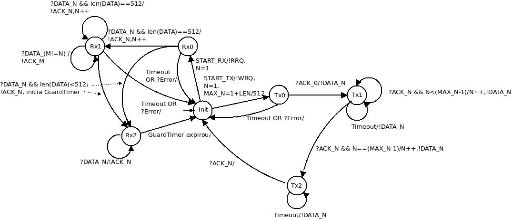

# Protocolo TFTP

O TFTP é um protocolo muito simples usado para transferir arquivos. É de isso que vem seu nome, Trivial File Transfer Protocol ou TFTP. O TFTP foi implementado no topo do protocolo UDP. Pode ser usado para mover arquivos entre máquinas em diferentes redes que implementam UDP, foi projetado para ser pequeno e fácil de implementar. Portanto, falta-lhe mais das características de um FTP regular. A única coisa que ele pode fazer é ler e gravar arquivos de/para um servidor remoto. Não pode listar diretórios e atualmente não tem provisões para autenticação de usuário. Em comum com outros protocolos da Internet, ele passa bytes de 8 bits de dados.

Uma transferência é estabelecida enviando um pedido (WRQ para escrever em um sistema de arquivos estrangeiro, ou RRQ para ler a partir dele), e receber um resposta positiva, um pacote de confirmação para gravação ou os primeiros dados pacote para leitura. Em geral, um pacote de confirmação conterá o número do bloco do pacote de dados que está sendo reconhecido. Cada dado pacote tem associado a ele um número de bloco; números de bloco são consecutivos e começam com um. Uma vez que a resposta positiva a um pedido de escrita é um pacote de confirmação, neste caso especial o número do bloco será zero. (Normalmente, uma vez que um pacote de confirmação está reconhecendo um pacote de dados, o pacote de reconhecimento conter o número do bloco do pacote de dados que está sendo reconhecido.) Se a resposta é um pacote de erro, então o pedido foi negado.

Os dados são mandados em blocos de 512 bytes. O fim de uma transferência é marcado por um pacote DATA que contém entre 0 e 511 bytes de dados.

O TFTP suporta cinco tipos de pacotes:

opcode | operation
:----: | :--------
1      | Read request (RRQ)
2      | Write request (WRQ)
3      | Data (DATA)
4      | Acknowledgment (ACK)
5      | Error (ERROR)

### Sintaxe e codificação das mensagens

**Pacote RRQ/WRQ**

2 bytes | string | 1 byte | string | 1 byte
:-----: | :----: | :----: | :----: | :----:
opcode | nome do arquivo | 0 | modo | 0

**Pacote DATA**

2 bytes | 2 bytes | n bytes
:-----: | :-----: | :-----:
opcode | bloco | dados

**Pacote ACK**

2 bytes | 2 bytes
:-----: | :-----:
opcode | bloco

**Pacote ERROR**

2 bytes | 2 bytes | string | 1 byte
:-----: | :-----: | :----: | :----: 
opcode | código de erro | mensagem de erro | 0

### Máquina de estado finito

### Funcionamento

Cria-se o arquivo de teste, cria-se a instancia do "ClientTFTP" passando IP(string), port(int) e valor do timeout em segundos. O metodo recebe implementa a chamada com o RRQ(Read Request do TFTP) para o recebimento de um arquivo do servidor e o metodo envia implementa a chamada com o WRQ(Write Request do TFTP) para a escrita do arquivo em um servidor.

Para executar o programa teste de esboço (test.py) basta executar "python3 teste.py <endereco_IP> <porta> <timeout> <nome_do_arquivo> <modo_envio(1-RRQ 2-WRQ)>
